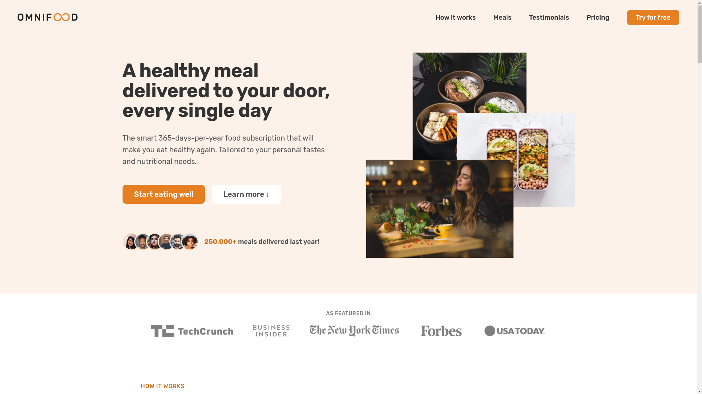
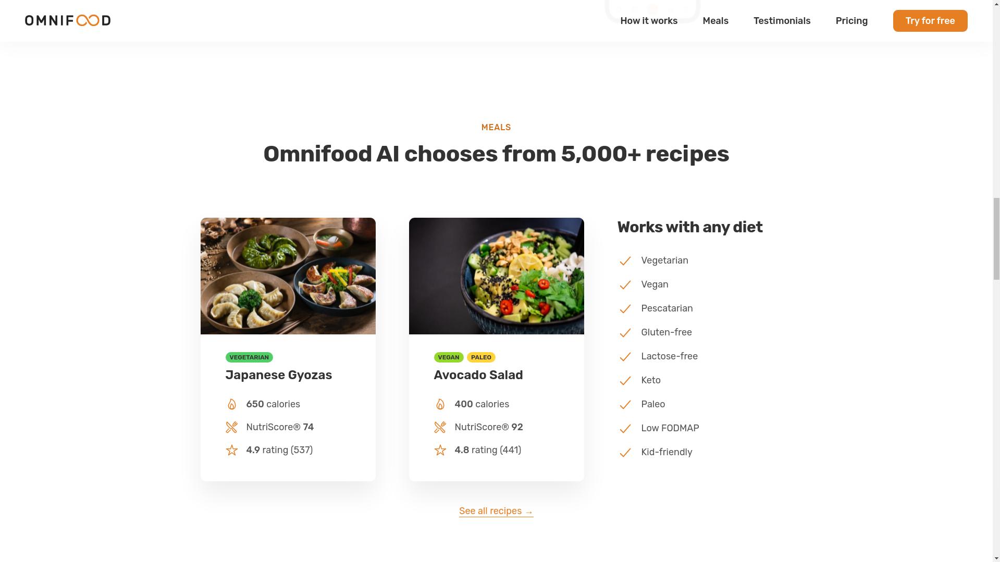
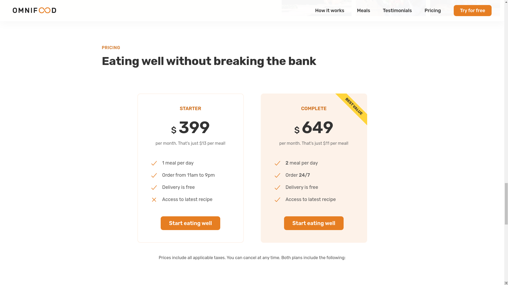
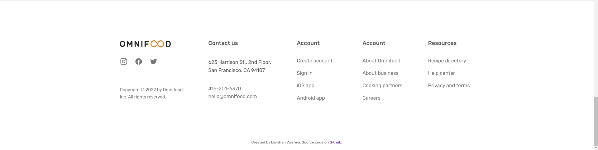

# Omnifood project

<details>
 <summary><strong>Table of Contents</strong> (click to expand)</summary>
	
- [Overview](#overview)
  - [Technologies used](#technologies-used)
- [Challenges faced](#challenges-faced)
- [Learning outcomes](#learning-outcomes)
- [Screenshots](#screenshots)
- [Directory structure](#directory-structure)
- [Collaboration](#collaboration)
- [Contact me](#contact-me)

</details>

## Overview

Omnifood is a website for fictional food delivery app which uses AI to provide meal ideas. The website is created using HTML and CSS. It has a beautiful and easy to use UI. The website works responsively on desktop, tablet and mobile.

Live preview: [Link](https://omnifood.darshanv.dev)

[](https://app.netlify.com/sites/naughty-poincare-2c7926/deploys)

### Technologies used

- HTML
- CSS
- JavaScript (only for responsiveness)

## Challenges faced

This was one of the first projects for me where I had the design and had to create the website from it. I found it easier to work with design rather than making decisions on the fly. I learnt to how to make a website responsive for the first time with this project. It was a interesting challenge, but I managed to make it work! Another challenge was that I hadn't learnt JavaScript yet, but I needed it for the mobile navigation bar. It turned out to be easier than expected!

Here is the code which I used

```js
const btnNav = document.querySelector(".btn-mobile-nav");
const headerEl = document.querySelector(".header");

btnNav.addEventListener("click", function () {
	headerEl.classList.toggle("nav-open");
});
```

After this, I realized that navigation bar is only visible from the top of the page. So I used Intersection observer API to make navigation bar "sticky" when the hero section is out of viewport.

```js
const sectionHeroEl = document.querySelector(".section-hero");

const obs = new IntersectionObserver(
	function (entries) {
		const ent = entries[0];

		if (!ent.isIntersecting) document.body.classList.add("sticky");
		if (ent.isIntersecting) document.body.classList.remove("sticky");
	},
	{
		root: null,
		threshold: 0,
		rootMargin: "-80px",
	}
);
obs.observe(sectionHeroEl);
```

## Learning outcomes

In terms of CSS, this project really taught me a lot! I realized the power of flexbox, grid and media queries to create beautiful and responsive website design. For the first time I worked on mobile and tablet design, and this was a great deal of fun to learn.

In terms of HTML, I learnt why one should use semantic tags instead of `div` everywhere. Got a basic understanding of SEO and google's lighthouse tool.

I also learnt how to deploy websites to [netlify](https://www.netlify.com/), and use DNS to link my custom domain to the deployed website. Along with this, got basics of Open Meta tags and web manifest to add logos to desktop apps in mobile.

## Screenshots

### Hero section



### Meals section



### Testimonial section


### Pricing section



### Footer



## Directory structure

```
.
├── content.md
├── css
│   ├── general.css
│   ├── queries.css
│   └── style.css
├── img
│   ├── app
│   │   ├── app-screen-1.png
│   │   ├── app-screen-2.png
│   │   └── app-screen-3.png
│   ├── apple-touch-icon.png
│   ├── customers
│   │   ├── ben.jpg
│   │   ├── customer-1.jpg
│   │   ├── customer-2.jpg
│   │   ├── customer-3.jpg
│   │   ├── customer-4.jpg
│   │   ├── customer-5.jpg
│   │   ├── customer-6.jpg
│   │   ├── dave.jpg
│   │   ├── hannah.jpg
│   │   └── steve.jpg
│   ├── eating.jpg
│   ├── favicon-192.png
│   ├── favicon-512.png
│   ├── favicon.png
│   ├── gallery
│   │   ├── gallery-10.jpg
│   │   ├── gallery-11.jpg
│   │   ├── gallery-12.jpg
│   │   ├── gallery-1.jpg
│   │   ├── gallery-2.jpg
│   │   ├── gallery-3.jpg
│   │   ├── gallery-4.jpg
│   │   ├── gallery-5.jpg
│   │   ├── gallery-6.jpg
│   │   ├── gallery-7.jpg
│   │   ├── gallery-8.jpg
│   │   └── gallery-9.jpg
│   ├── hero-min.png
│   ├── hero.png
│   ├── hero.webp
│   ├── logos
│   │   ├── business-insider.png
│   │   ├── forbes.png
│   │   ├── techcrunch.png
│   │   ├── the-new-york-times.png
│   │   └── usa-today.png
│   ├── meals
│   │   ├── meal-1.jpg
│   │   └── meal-2.jpg
│   ├── omnifood-logo.png
│   └── screenshots
│       ├── footer.png
│       ├── hero.png
│       ├── meals.png
│       ├── pricing.png
│       └── testimonial.png
├── index.html
├── js
│   └── script.js
├── manifest.webmanifest
└── README.md

9 directories, 54 files
```

## Collaboration

If you have found a bug, suggesting an improvement or want to collaborate then please raise an [issue](https://github.com/DarshanVaishya/omnifood/issues) or create an [pull request](https://github.com/DarshanVaishya/omnifood/pulls).

## Contact me

- [Twitter](https://twitter.com/darshan_vaishya)
- [LinkedIn](https://www.linkedin.com/in/darshan-vaishya-ba99001a9/)
